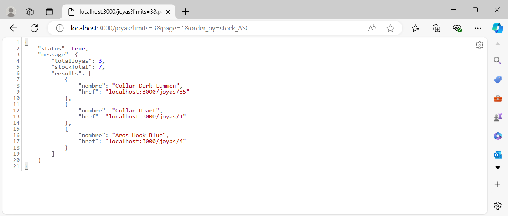

# API_REST_Avanzado

La tienda de joyas My Precious Spa necesita cambiar su aplicación de escritorio por una
moderna y dinámica. Para realizar esta tarea, contactó a un desarrollador Full Stack
Developer que desarrolle la API REST de una aplicación cliente para satisfacer las
necesidades puntuales de sus usuarios de una forma eficiente, mantenible y eficaz.

Deberás crear una API REST que permita:
1. Límite de recursos
2. Filtro de recursos por campos
3. Paginación
4. Ordenamiento
5. Estructura de datos HATEOAS

CAPTURAS DE LA RESPUESTA DESARROLLADA:

Query que limita los resultados a 3, muestra la primera página y ordena por STOCK ascendente.

Mantiene la query anterior pero muestra la segunda página

Query que limita los resultados a 3, muestra la primera página y ordena por PRECIO ascendente.

Ruta que permite filtrar los resultados. Se filtra estableciendo un precio mínimo y un precio máximo, los registros del tipo "aro" y metal "oro".

Se muestra el log entregado por el middelware (Registro por terminal del servidor)

